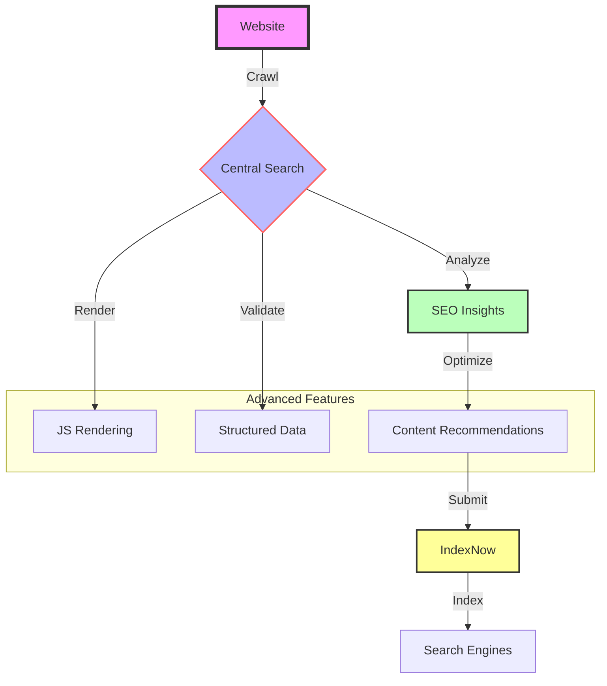

# 🌐 Central Search: SEO Optimization Toolkit


**An advanced web crawling and SEO toolkit designed to supercharge your website’s search engine performance.**

---

## 🚀 Overview | প্রোজেক্ট পরিচিতি

Central Search, powered by SheikhBot, is a state-of-the-art solution for web crawling, SEO analysis, and optimization. Whether you're aiming to improve discoverability, boost rankings, or streamline indexing, this toolkit delivers AI-driven insights and cutting-edge features.

### 🔗 Community & Support | সম্প্রদায় এবং সহায়তা
- **Telegram**: [t.me/RecentCoders](https://t.me/RecentCoders)  
- **GitHub**: [SheikhBot Repository](https://github.com/sheikh-vegeta/SheikhBot)  

---

## 🌈 Workflow | প্রোজেক্ট প্রবাহ



---

## 📊 Build Status

[](https://github.com/sheikh-vegeta/SheikhBot/actions/workflows/crawl.yml)  
[](https://github.com/sheikh-vegeta/SheikhBot/actions/workflows/pages/pages-build-deployment)  
[](https://github.com/sheikh-vegeta/SheikhBot/actions/workflows/domain_processor.yml)

---

## ✨ Features | মূল বৈশিষ্ট্য

### 🔍 SEO Analysis | উন্নত SEO বিশ্লেষণ
- **Deep Crawling**: Multi-platform site scanning  
- **JS Rendering**: Detects dynamic content  
- **Structured Data**: Validates schema markup  
- **Insights**: Actionable SEO recommendations  

### 🤖 Optimization | বুদ্ধিমান অপ্টিমাইজেশন
- **Content Scoring**: AI-powered quality checks  
- **Mobile-First**: Ensures cross-device compatibility  
- **IndexNow**: Instant search engine updates  
- **Monitoring**: Tracks performance over time  

### SheikhBot Highlights
- Mobile-first crawling  
- JavaScript & AJAX processing  
- Adaptive crawl rates  
- Canonical URL support  
- AI content ranking  
- Robots.txt compliance  
- Sitemap & backlink analysis  
- Multi-language indexing  
- NLP & structured data extraction  

---

## 🛠️ Get Started | দ্রুত শুরু

### Prerequisites | প্রাক-আবশ্যকতা
- Python 3.8+  
- Chrome/Chromium  
- Git  

### Installation | ইনস্টলেশন
```bash
# Clone the repo
git clone https://github.com/sheikh-vegeta/SheikhBot.git
cd SheikhBot

# Install dependencies
pip install -r requirements.txt
```

### Usage | ব্যবহার
```bash
# Crawl a website
python main.py crawl https://example.com

# Submit to IndexNow
python main.py indexnow submit https://example.com/new-page
```

---

## 🚀 Advanced Setup | উন্নত কনফিগারেশন

### SEO Strategies | SEO কৌশল
- Optimized titles & headings  
- Mobile-first design  
- Schema markup support  
- Performance scoring  

### Customize | কনফিগারেশন
Edit `config.yml` for:  
- Crawl depth  
- Extraction rules  
- SEO parameters  
- Notifications  

---

## 💡 Best Practices | সর্বোত্তম অনুশীলন
1. Run regular SEO audits  
2. Monitor discoverability  
3. Apply optimizations  
4. Update dependencies  

---

## 🤝 Contribute | অবদান

We’d love your help!  

### Steps | অবদানের পদ্ধতি
1. Fork the repo  
2. Create a branch  
3. Commit changes  
4. Push your branch  
5. Submit a PR  

---

## 📄 License | লাইসেন্স

[MIT License](LICENSE) - Open-source and free  

---

## 🌟 Powered By | সমর্� tãoর্থিত
- **Community**: [t.me/RecentCoders](https://t.me/RecentCoders)  
- **Tech**: Python, AI, Web Crawling  
- **Mission**: Accessible SEO for all  

---

## 🛡️ Security | নিরাপত্তা
- Secure API keys  
- Regular updates  
- Trusted dependencies  
- Access controls  

---

## 📞 Contact | যোগাযোগ
- **Telegram**: [Recent Coders](https://t.me/RecentCoders)  
- **Email**: support@sheikhbot.dev  
- **Issues**: [GitHub Issues](https://github.com/sheikh-vegeta/SheikhBot/issues)  

**Crafted with ❤️ by the Open Source Community**
