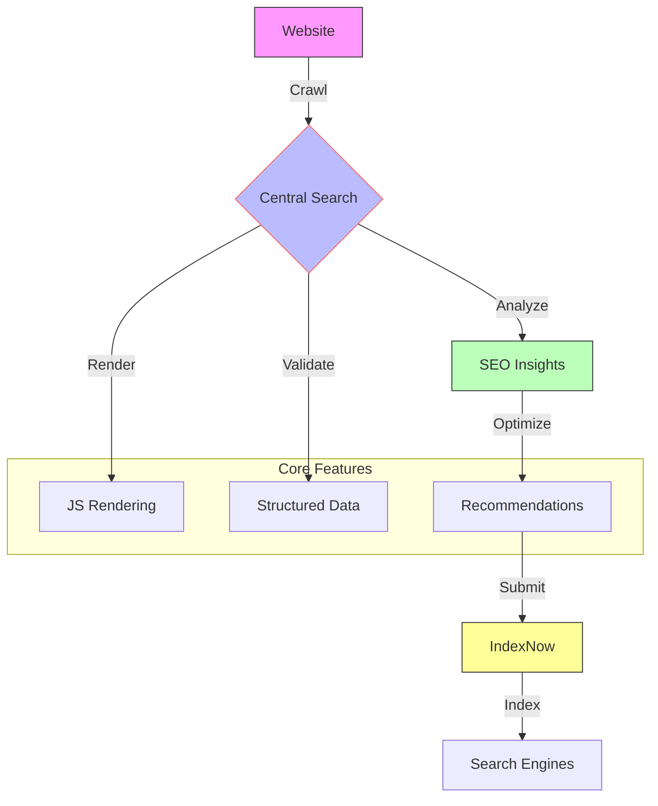

<div align="center">
  
</div>

# 🌐 Central Search: SEO Toolkit

**A next-gen web crawling and SEO optimization suite to elevate your site’s performance.**

---

## 🚀 Overview | প্রোজেক্ট পরিচিতি

Central Search, powered by SheikhBot, is your all-in-one solution for advanced web crawling, SEO analysis, and instant indexing. Built with AI and modern web technologies, it’s designed to make your website shine in search results.

🔗 **Community**: [Telegram](https://t.me/RecentCoders) | [GitHub](https://github.com/sheikh-vegeta/SheikhBot)

---

## 🌈 Workflow | প্রোজেক্ট প্রবাহ



---

## 📊 Status

<div align="center">
  <a href="https://github.com/sheikh-vegeta/SheikhBot/actions/workflows/crawl.yml">
    
  </a>
  <a href="https://github.com/sheikh-vegeta/SheikhBot/actions/workflows/pages/pages-build-deployment">
    
  </a>
  <a href="https://github.com/sheikh-vegeta/SheikhBot/actions/workflows/domain_processor.yml">
    
  </a>
</div>

---

## ✨ Features | মূল বৈশিষ্ট্য

### 🔍 SEO Analysis
- **Deep Crawl**: Scans across platforms  
- **JS Rendering**: Captures dynamic content  
- **Structured Data**: Validates schemas  
- **Insights**: Boosts SEO with precision  

### 🤖 Optimization
- **Content AI**: Scores quality smartly  
- **Mobile-First**: Adapts to all devices  
- **IndexNow**: Updates search engines instantly  
- **Monitoring**: Tracks progress 24/7  

### SheikhBot Edge
- Mobile-first indexing  
- JavaScript & AJAX support  
- Adaptive crawling  
- AI-driven ranking  
- Multi-language ready  

---

## 🛠️ Start Here | দ্রুত শুরু

### Prerequisites
- Python 3.8+  
- Chrome/Chromium  
- Git  

### Install
```bash
git clone https://github.com/sheikh-vegeta/SheikhBot.git
cd SheikhBot
pip install -r requirements.txt
```

### Run
```bash
# Crawl a site
python main.py crawl https://example.com

# Index a page
python main.py indexnow submit https://example.com/new-page
```

---

## 🚀 Advanced | উন্নত কনফিগারেশন

### SEO Boost
- Smart titles & headings  
- Mobile-ready design  
- Schema integration  
- Performance metrics  

### Customize
Edit `config.yml`:  
- Crawl depth  
- Extraction rules  
- SEO settings  
- Alerts  

---

## 💡 Tips | সর্বোত্তম অনুশীলন
- Audit regularly  
- Track visibility  
- Optimize often  
- Stay updated  

---

## 🤝 Contribute | অবদান

Join us!  
1. Fork it  
2. Branch off  
3. Commit changes  
4. Push it  
5. Open a PR  

---

## 📄 License | লাইসেন্স

[MIT License](LICENSE) - Free for all  

---

## 🌟 Built By | সমর্থিত
- **Community**: [t.me/RecentCoders](https://t.me/RecentCoders)  
- **Tech**: Python, AI, Crawling  
- **Goal**: SEO for everyone  

---

## 🛡️ Security | নিরাপত্তা
- Lock down API keys  
- Update often  
- Trust your deps  
- Control access  

---

## 📞 Reach Out | যোগাযোগ
- **Telegram**: [Recent Coders](https://t.me/RecentCoders)  
- **Email**: support@sheikhbot.dev  
- **Issues**: [GitHub](https://github.com/sheikh-vegeta/SheikhBot/issues)  

<div align="center">
  <strong>Made with ❤️ by Open Source Enthusiasts</strong>
</div>

